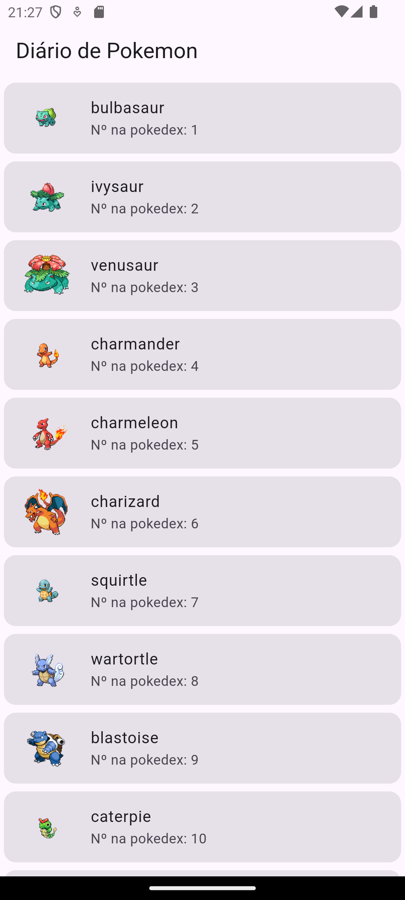

# diario_pokemon

Listagem e visualização de Pokémons

## Sobre o aplicativo

Este porjeto é uma aplicação desenvolvida utilizando Flutter onde o objetivo é a listagem e 
visualização de pokémons

Pacotes utilizados:

- [GetX](https://pub.dev/packages/get)
- [Http](https://pub.dev/packages/http)

Neste projeto também foi utilizado a API do **pokeapi.co** para obter os detalhes dos pokémons.

## Prints

